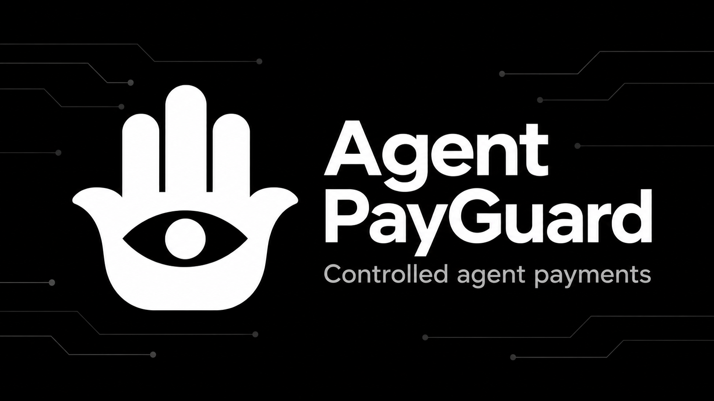

# Agent PayGuard

**A pre-payment control layer for AI-agent workflows.**

Agent PayGuard is a prototype for making agent-initiated purchases subject to an
owner's rules. It separates recipient risk evidence from deterministic project
policy, showing why an intended payment is allowed, capped, held for review, or
denied. **Intercepta is the risk-check provider; Agent PayGuard owns the project
policy and its explanation.**

Saved Intercepta observations and explicitly simulated scenarios use the same
policy engine through separate adapters. Toxic Score is displayed as a raw
signal, not a numerical decision threshold. Task permissions can be saved and
inspected; wallet signing, settlement, and end-to-end payment execution remain
**NOT CONNECTED**.

[Run the demo](docs/SECOND_COMPUTER.md) · [Implementation and limits](docs/HANDOFF.md) · [Open work](docs/TODO.md) · [Logo](docs/assets/agent-payguard-logo.png)

## What the current prototype demonstrates

| Capability | What it means today |
| --- | --- |
| Recipient risk evidence | An authorized manual Intercepta address check can save evidence for later inspection. Reusing a saved record does not rescan it. |
| Explainable project policy | Trait labels, evidence availability and completeness, unknown observations, and the requested amount determine `ALLOW`, `ALLOW_WITH_LIMIT`, `HOLD`, or `DENY`. |
| Policy Sandbox | Three explicitly synthetic inputs run through the same policy engine. They are not live provider responses and do not create scan records or payments. |
| Task permissions | Save and inspect an application task grant, including its configured limits. This is not a wallet balance or a connected spending ledger. |
| Decision evidence | Download a snapshot of the current intent, project decision, and available scan evidence. It is a diagnostic artifact, not a signed attestation or payment receipt. |

The demonstration cap of **0.001 USDC** is a project policy choice, not an
Intercepta score threshold or a general safety guarantee. `ALLOW` describes the
project's policy result; it does not mean a wallet signed, a payment settled, or
the recipient is safe. Provider-source, network, time, and coverage limitations
remain visible separately from the policy result.

## How it is built

The interface and services are written in TypeScript, with React/Vite for the
web UI and Express for local services. The project also contains buyer/seller
x402 work for a sample-report purchase; that purchase is not the completed
execution path of the current demo.

The policy path is deliberately small:

**Saved provider record → validated adapter → normalized evidence → pure policy → decision and reason.**

- [Normalized evidence](shared/normalized-risk-evidence.ts) defines the policy's input.
- [Evidence adapters](shared/risk-evidence-adapters.ts) keep live-source records and synthetic scenarios distinct.
- [Payment policy](shared/payment-policy.ts) computes a decision without depending on the scanner, HTTP transport, or saved-record storage.
- [Policy scenarios](shared/policy-scenarios.ts) contain synthetic inputs rather than predetermined outcomes.

The original report scenario uses a bundled Solidity contract and structural
observations; it is not a contract security audit. An autonomous AI buyer,
enforced remaining-budget ledger, and real payment execution are still open work.

## Run locally

Use the Node version in [`.nvmrc`](.nvmrc) and the locked dependencies. Follow
the [personal-computer startup and acceptance guide](docs/SECOND_COMPUTER.md),
including its configuration and quota checks. The page is served only on
`127.0.0.1:47915`.

```sh
npm run demo:prepare   # local page build; no risk request
npm run demo:check     # offline preflight; no network or service
npm run demo:live      # same Demo on the personal Mac, after quota/key checks
```

`demo:check` passing proves only local preparation. It does not prove provider
availability, response semantics, balance, signing, or payment. A real risk API
response is evidence from one authorized manual request; local tests and
synthetic data are not API evidence. Unavailable, invalid, or insufficient
decision evidence stays on the conservative policy path.

The old `private:risk` name remains an internal compatibility alias. The company
offline experiment does not make real risk requests. Do not run `npm run dev` or
`npm run setup:local` for this acceptance path.

## Local checks

`npm run ci:local` runs type checking, the offline test suite, and the private
page and buyer builds. The [handoff](docs/HANDOFF.md) records scoped browser
checks and their evidence boundaries. Offline screenshots are explicitly
labelled; they are not proof of live scanning or payment.

Saving a permission does not start the task or connect it to a signer. Spent,
reserved, available budget and wallet balance remain unknown until their real
sources are connected. Local checks, hosted CI, live provider calls, and actual
payments are separate evidence.

## Brand and AI assistance

The black-and-white hand-and-eye mark represents the project's control boundary.
The [logo](docs/assets/agent-payguard-logo.png) and
[cover](docs/assets/agent-payguard-cover.png) are project artwork, generated with
OpenAI image generation and selected by the project owner. They are not demo
screenshots or evidence of a payment.

Codex assisted implementation, tests, documentation and interface iteration.
The project owner defined the purchasing scenario, directed product and visual
revisions, and specified acceptance requirements. Development use of AI does
not imply an application-level autonomous agent is connected.

## Sources and limits

- [x402 Foundation](https://github.com/x402-foundation/x402): SDK and official examples; prior learning sample remains separate from this new project.
- [Quick Scan Address](https://docs.web3antivirus.io/reference/quick-scan-address): address risk only, not complete authorization or token validation. Any correspondence must be stated honestly.
- [Intercepta challenge](https://ethglobal.com/events/tokyo2026/prizes/intercepta): participation requirements are separate from the capabilities demonstrated here.
- [Earlier architecture diagram](docs/architecture.html): includes planned components; consult the current handoff for delivered behavior.

Do not replace missing provider or payment evidence with local tests or simulated receipts.
