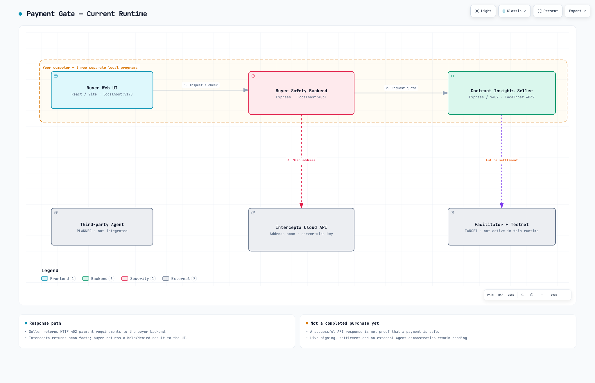

# Intercepta payment gate — local demo

## Current preview: offline Pay + weighted assessment

For the current demonstration, double-click **`docs/offline-pay.html`**. The new
Chinese page is one responsive view with three regions: wallet and task limit,
order and grouped synthetic recipients, then decision and plain-language reason.
It needs no API key, wallet connection, server or network request. All six
recipient addresses and all evidence are visibly synthetic. **Demo allow does not
mean signed, submitted, paid, or report purchased.** See [private Mac preview
instructions](docs/OFFLINE_PREVIEW.md).

To rebuild the single-file page from the React source, run `npm run demo:build`.
An optional local-only simulation endpoint can be started with `npm run demo:serve`;
it binds to `127.0.0.1`, serves only the generated page and
`POST /api/demo/assess`, and still cannot pay. The file version never fetches.
Both modes use the same `weighted-demo-v1` pure assessment function.

The backend setup below describes the older development application. Do not run
it on the restricted company computer: localhost does not guarantee that its
backend will avoid external services. Live payment is not complete.

Work in progress: a buyer-side pre-signing safety gate for an x402 **Contract Insights** purchase. The seller analyzes a bundled Solidity sample using lexical counts, not a security audit. This is not production custody or a complete security guarantee.

## What you can demonstrate today

The default **Intercepta payment check** screen is an explicitly labelled offline illustration. Its Check risk button does not call the API or pay: synthetic presets display Block / Pause / Continue, and Continue is not a real authorization. Existing request only displays a previously loaded response. For the existing live non-payment flow below, open **Details → Report offer**; the separate Scenario is an archived fictional example.

1. Open the English purchase page and inspect the bundled contract sample.
2. Get a real HTTP 402 quote from the local seller for **0.001 test USDC**.
3. Explicitly request an Intercepta address check using your locally configured key.
4. See scan facts and a **held payment**, with no signature or settlement.

Real API transport has been verified. A zero score does not establish safe payment or testnet coverage. **Successful payment, a proven malicious-address block, and a third-party Agent integration are not completed in this release.** Offline signing tests are not evidence of a live payment. The existing HTTP API is not an integrated AI agent.

See the [English architecture](docs/architecture.html) and [second-computer setup](docs/SECOND_COMPUTER.md). Download the HTML and open it locally; GitHub does not execute HTML in repository previews.

## Start

Use the Node version in `.nvmrc`, then `npm ci`, `npm run doctor`, `npm run dev`. Open `http://127.0.0.1:5178`. Node 22.12–26 is allowed; initial development used 26.6.0. Both backends and the web page run locally. Do not expose them publicly.

Run `npm run setup:local` once to create an empty isolated merchant wallet locally and populate only its public address. This lets the seller quote a price without configuring a buyer signer or enabling payments. Its secret stays in ignored `.runtime/`; this is not a wallet backup or a production wallet. The command refuses to overwrite an existing `.env` or key.

Alternatively, copy `.env.example` to `.env` locally and fill only personal test credentials. Missing credentials must pause payment. Never commit `.env`. `ENABLE_TESTNET_PAYMENTS` defaults false. No code path may bypass a missing Intercepta check. Do not use a wallet holding real funds.

## Checks

`npm run typecheck` · `npm test` · `npm run build`

This slice demonstrates HTTP 402 and an explicit real address scan when a valid key is configured. Unknown scan semantics or network coverage hold the payment. The runtime deliberately keeps payments disabled even if the environment flag is changed. Application AI is not configured; manual requests must not be presented as autonomous Agent purchases.

See [execution handoff](docs/HANDOFF.md) and [working log](docs/WORKING_LOG.md). Seller code belongs in `apps/seller`, buyer service in `apps/buyer`, and UI in `apps/web`.

## Sources and limits

- [x402 Foundation](https://github.com/x402-foundation/x402): SDK and official examples; prior learning sample remains separate from this new project.
- [Intercepta prize requirements](https://ethglobal.com/events/tokyo2026/prizes/intercepta): real pre-sign/accept API call, visible successful/blocked payment, public repository and API feedback. This project is not published yet.
- [Quick Scan Address](https://docs.web3antivirus.io/reference/quick-scan-address): address risk only, not complete authorization or token validation. Risk data is mainnet; payments can use testnet. Any correspondence must be stated honestly.

Before a complete payment demonstration: implement and verify the guarded signing/settlement path, a justified risk decision, a real test-payment receipt, and a third-party Agent client. Before submission: confirm prize requirements, API feedback, independent review of the final revision, and a second-computer run. Do not replace missing evidence with simulated receipts.
